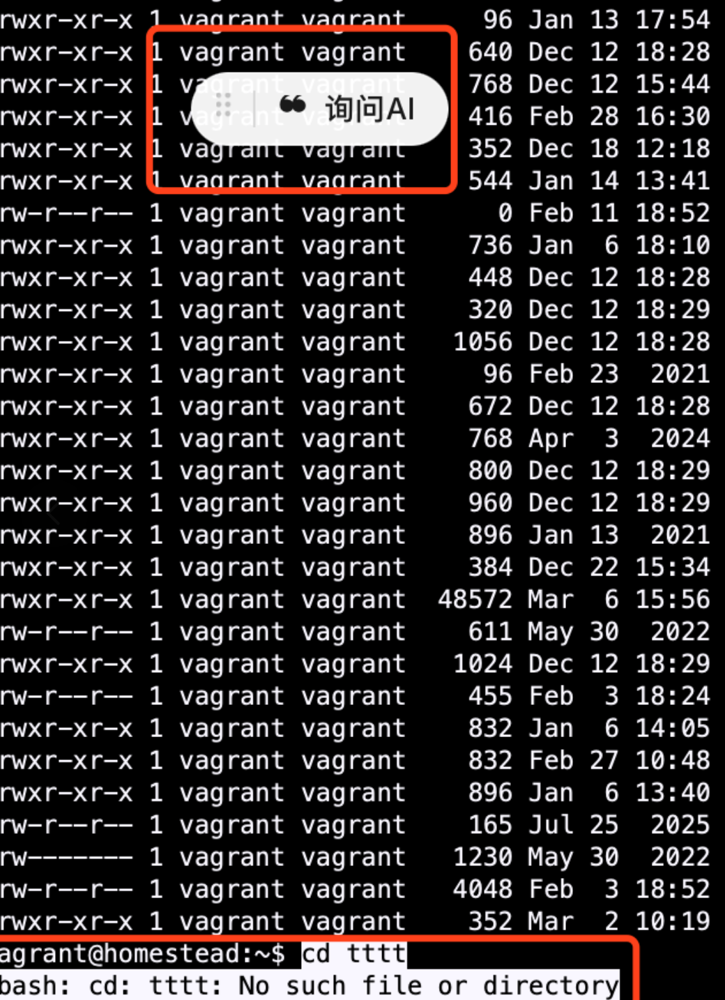
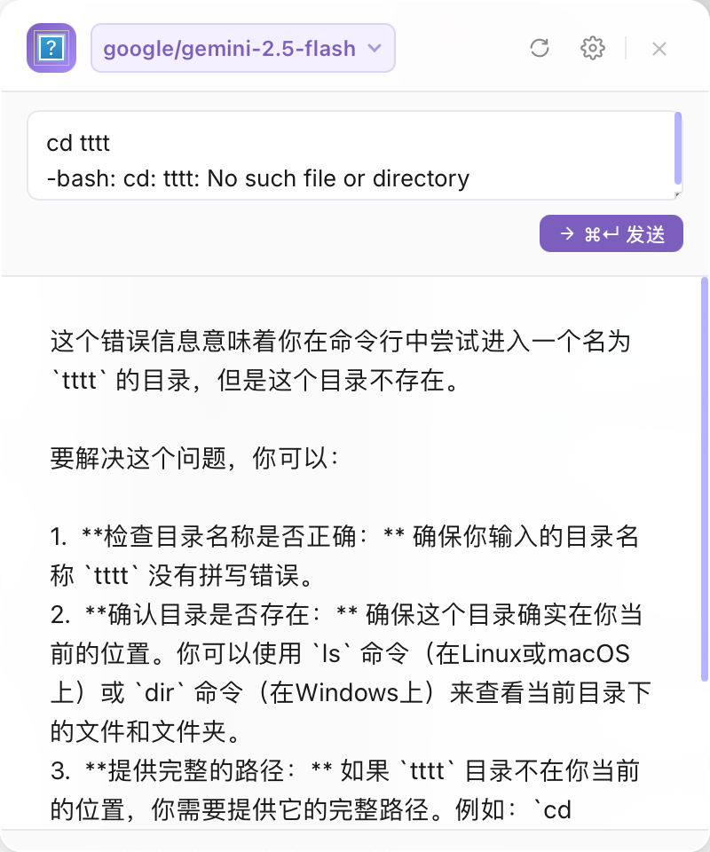
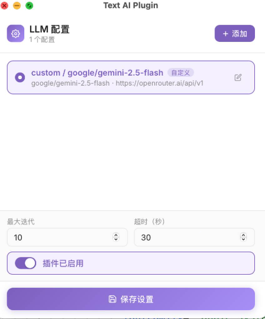

# Text AI Plugin

一个使用 AI Coding 开发的文本选择助手工具，可以在任何地方选中文本后快速调用 AI 进行问答。

## 功能特点

- 🎯 **全局文本选择**: 在任何应用中选中文本后，通过浮动球快速调用 AI
- 💬 **智能问答**: 支持自定义 LLM 模型，对选中的文本进行提问和分析
- 🎨 **简洁界面**: 悬浮窗设计，不干扰正常工作流程
- 📝 **历史记录**: 保存所有问答历史，方便回顾
- ⚙️ **灵活配置**: 支持自定义 API 端点、模型选择、超时设置等

## 技术栈

Rust + Tauri 2.0

## 使用截图

### 1. 文本选择与悬浮按钮

在任何应用中选中文本并复制后，会自动弹出"询问AI"悬浮按钮：

### 2. AI 问答界面

点击悬浮按钮后，在弹出窗口中查看 AI 的实时回答：

### 3. 设置界面

支持配置自定义 LLM 模型，包括模型选择、API 端点、超时设置等：

## 关于 AI Coding

这个项目完全使用 AI 辅助编程工具开发，展示了 AI 在实际软件开发中的应用潜力。从架构设计到代码实现，AI 都提供了有价值的建议和帮助。

## License

MIT
